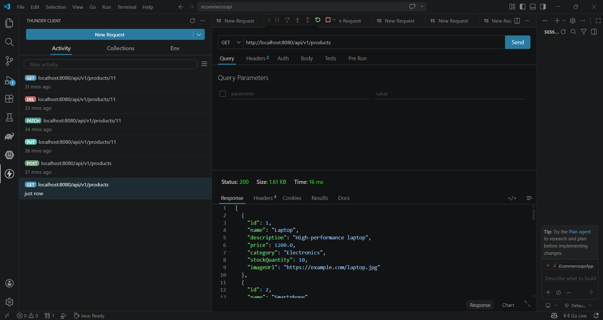
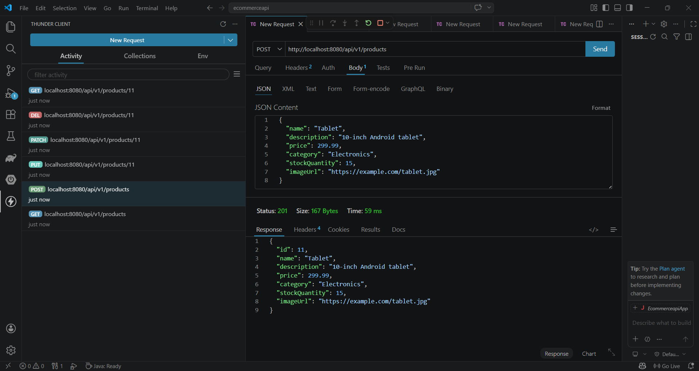
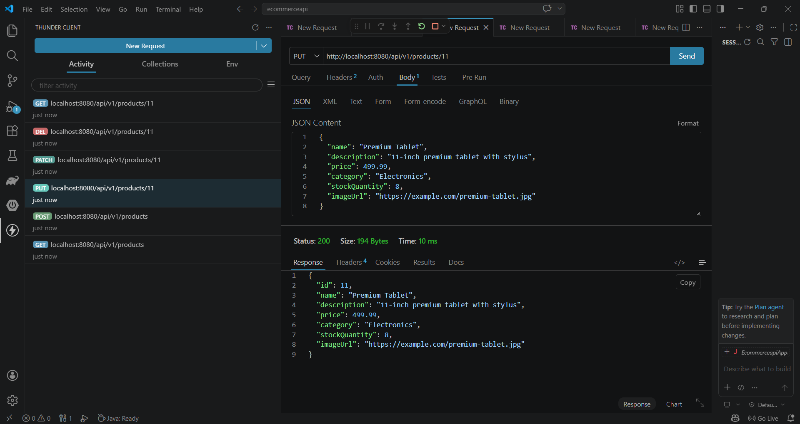
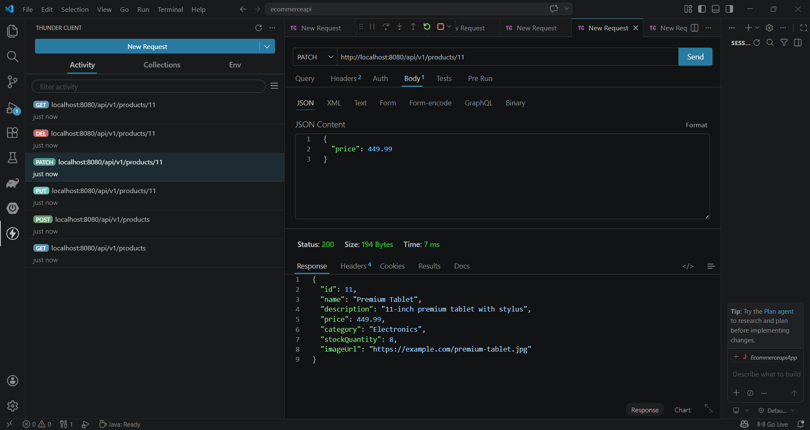
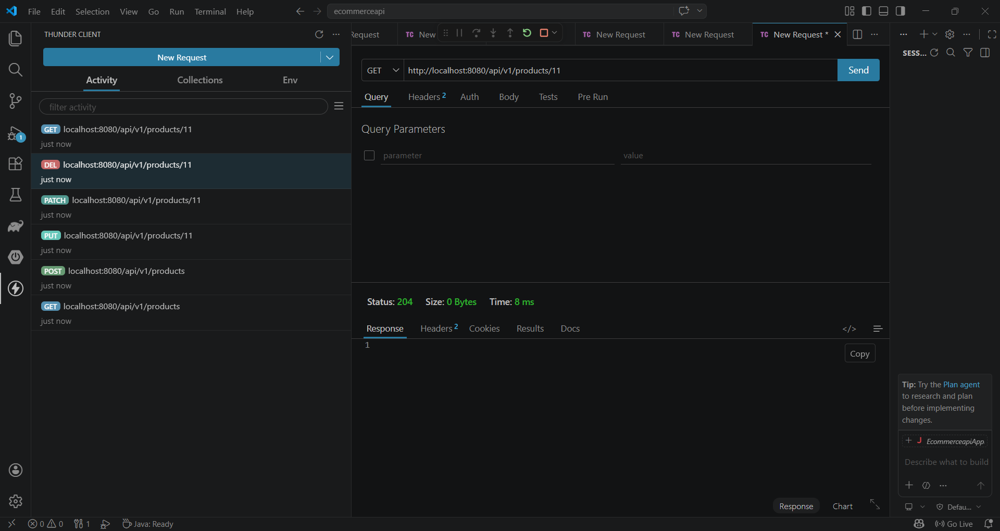
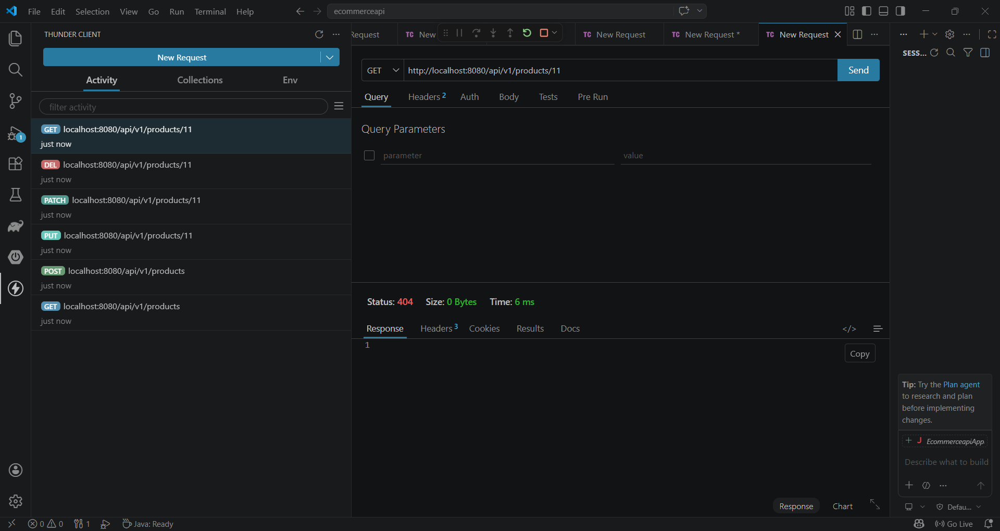

# 🛒 E-Commerce API

## 📌 Project Overview

This project is a RESTful API built using Spring Boot for Laboratory 7.
It simulates a simple e-commerce backend where products can be created, viewed, updated, and deleted.

## 👨‍💻 Authors

- Balanquit, Junel M.
- Balansag, Geraldine R.

## ⚙️ Technologies Used

- Java 25
- Spring Boot 4.0.5
- Spring Web
- Lombok
- Gradle

## 🚀 How to Run the Application

1. Open the project in VS Code
2. Make sure Java 25 is installed
3. Run the application by clicking Run on `EcommerceapiApplication.java`
4. Open browser or Thunder Client at:
   `http://localhost:8080/api/v1/products`

## 📡 API Endpoints

| Method | Endpoint | Description |
|--------|----------|-------------|
| GET | `/api/v1/products` | Get all products |
| GET | `/api/v1/products/{id}` | Get product by ID |
| POST | `/api/v1/products` | Create new product |
| PUT | `/api/v1/products/{id}` | Replace entire product |
| PATCH | `/api/v1/products/{id}` | Partially update product |
| DELETE | `/api/v1/products/{id}` | Delete product |
| GET | `/api/v1/products/filter?filterType=category&filterValue={category}` | Filter by category |
| GET | `/api/v1/products/filter?filterType=name&filterValue={keyword}` | Filter by name |

## 📸 API Testing Screenshots

### 🔹 Get All Products

### 🔹 Create Product (POST) - 201 Created

### 🔹 Update Product (PUT) - 200 OK

### 🔹 Partial Update (PATCH) - 200 OK

### 🔹 Delete Product (DELETE) - 204 No Content

### 🔹 Get Deleted Product - 404 Not Found

## ⚠️ Limitations

- Uses in-memory storage (data resets when application restarts)
- No database integration
- No authentication

## ✅ Conclusion

This project successfully implements a RESTful API based on Laboratory 7 requirements.
All CRUD operations and filtering features are working properly.